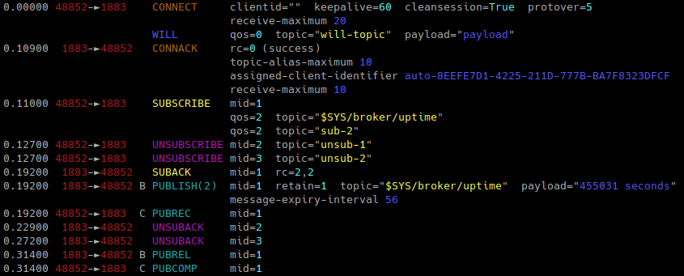

# mqttshark - MQTT formatter for tshark

mqttshark will run tshark, the terminal network packet capture tool, and
attempt to pretty print any MQTT messages received.

It is still a long way from being complete, but is nevertheless useful right now.

It requires at least Python 3.6, and possibly something more recent than that.
It also requires tshark to be installed.

## Usage

Run listening to port 1883 on the first non-loopback network interface:

```
mqttshark
# Run a test
mosquitto_sub -h test.mosquitto.org -t '$SYS/broker/uptime' -t sub-2 -U unsub-1 -U unsub-2 \
	-q 2 -V 5 --will-topic will-topic --will-payload payload
```



Run on a specific network interface:
```
mqttshark -i eth0
```

There are lots of ways of choosing how to display the output, see the help:
```
mqttshark -h
```

## Bugs

* Will properties are not displayed - this seems to be a missing feature in tshark
* v5 subscription options are not displayed
* Payloads with new lines may cause problems

## Contact

https://github.com/ralight/mqttshark
